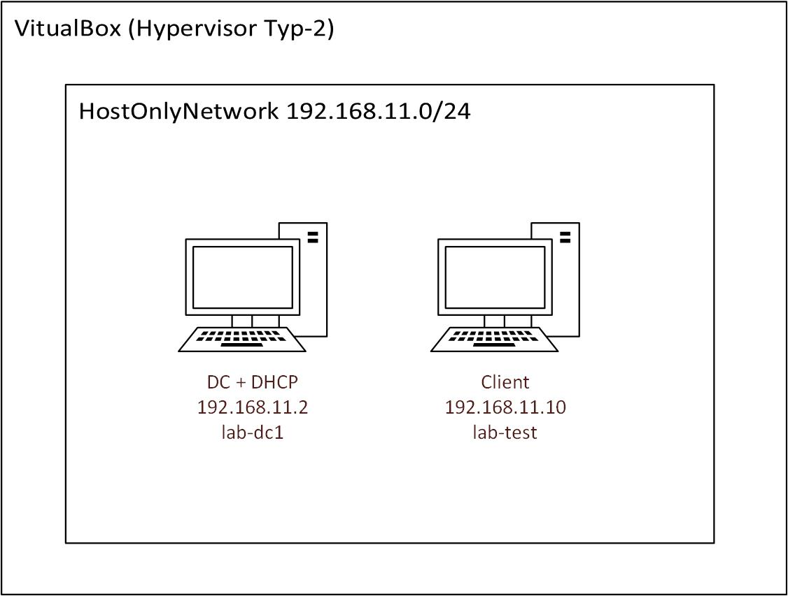

# Active Direcotry Lab mit DHCP | M300, LB2, ST18D

## Inhaltsverzeichnis
- [Active Direcotry Lab mit DHCP | M300, LB2, ST18D](#active-direcotry-lab-mit-dhcp--m300-lb2-st18d)
  - [Inhaltsverzeichnis](#inhaltsverzeichnis)
  - [1. Einführung](#1-einführung)
    - [1.1 Netzwerkplan](#11-netzwerkplan)
  - [2. Installation](#2-installation)
    - [1.1 Voraussetzungen](#11-voraussetzungen)
    - [1.1 Respository Klonen](#11-respository-klonen)
    - [2.2 Domänen Controller erstellen](#22-domänen-controller-erstellen)
    - [2.3 Windows Testserver erstellen](#23-windows-testserver-erstellen)
  - [3. Sicherheitsaspekte](#3-sicherheitsaspekte)
  - [4. PowerShell Scripts](#4-powershell-scripts)
  - [9. Quellenangabe](#9-quellenangabe)

  - [9. Quellenangabe](#9-quellenangabe)

## 1. Einführung

Dieses Projekt wurde für die LB2 M300 entwickelt, mit dem Ziel eine Active Directory Testumgebung umzusetzen auf Basis von "Infrastructure as Code". 
Die Testumgebung setzt einen Domänencontroller mit DHCP Funktion auf und einen Testserver, welcher vom DHCP vom DC eine IP zugewiesen wird und dieser dann autmatisch der Domäne joint. 
Wir verwenden hierfür die Tools Vagrant und Virtualbox. 

### 1.1 Netzwerkplan
<p>
  
</p>

## 2. Installation


### 1.1 Voraussetzungen


### 1.1 Respository Klonen
```bash
git clone https://github.com/FailForImprove/m300_lb
```

Dieses `Vagrantfile` benutzt das [`vagrant-reload`](https://github.com/aidanns/vagrant-reload) Plugin zum Neustart der Windows-VMs während der Bereitstellung. Wenn Sie dieses Plugin noch nicht installiert haben, können Sie es mit folgendem Command installieren:

```bash
vagrant plugin install vagrant-reload
```

Um die Boxen zu bauen, verwenden Sie `vagrant up`.
Jede Box wird zweimal neu gestartet, bis alle Funktionen ausgeführt werden..


### 2.2 Domänen Controller erstellen
Zuerst erstellen wir den Domänen Controller mit DHCP Service.

```bash
vagrant up lab-dc1
```

Danach läuft die Domäne `party.hard` und läuft unter der IP Adresse `192.168.11.2`.


### 2.3 Windows Testserver erstellen

```bash
vagrant up lab-test
```

--- 

Client sollte der Domäne `party.hard` beigetreten sein und vom DHCP die IP Adresse `192.168.11.10` erhalten.

## 3. Sicherheitsaspekte

Hostonly Netzwerk für ein geschlossenes Testsystem. Dies ist besonders wichtig, da wir ein DHCP Service auf dem Domänen Controller im Einsatz haben.

---

## 4. PowerShell Scripts

All Scripts are located in Folder [`m300_lb/lb2/scripts`](https://gitlab.com/KakaoSchluerfer/m300_lb/-/blob/master/lb2/scripts/)

|Funktion|Beschreibung|Anwendung|
|:--|:--|--:|
|[`ConfigureRebootOnNode.ps1`](https://github.com/FailForImprove/m300_lb/blob/main/LAB/provision/ConfigureRebootOnNode.ps1)|Konfiguriert bei Bedarf den Neustart des Hosts|``lab-test``|
|[`DSCInstallDHCP.ps1`](https://github.com/FailForImprove/m300_lb/blob/main/LAB/provision/DSCInstallDHCP.ps1)|Installieren Sie die DHCP-Rolle, RSAT-DHCP-Komponente, autorisieren Sie den DHCP-Server in AD nach der Installation und konfigurieren Sie den Bereich.|`lab-dc1`|
|[`DSCInstallDomain.ps1`](https://github.com/FailForImprove/m300_lb/blob/main/LAB/provision/DSCInstallDomain.ps1)|Installieren Sie die AD DS-Rolle, die RSAT-ADDS-Komponente, und konfigurieren Sie die "PARTY.HARD" Domäne.|`lab-dc1`|
|[`SCJoinDomain.ps1`](https://github.com/FailForImprove/m300_lb/blob/main/LAB/SCJoinDomain.ps1)|Host zur Active Directory-Domäne hinzufügen.|`lab-test`|
|[`PreDSCInstall.ps1`](https://github.com/FailForImprove/m300_lb/blob/main/LAB/provision/PreDSCInstall.ps1)|Installation erforderlich für Arbeit DSC-Module.|`lab-dc1` / `lab-test`|

---


## 9. Quellenangabe

- https://vagrantup.com/docs
- https://medium.com/subpointsolutions/building-a-disposable-windows-2016-domain-controller-in-20-minutes-with-vagrant-fce6eb4e01bd
- https://github.com/dsccommunity/ActiveDirectoryDsc
- https://github.com/dsccommunity/xDhcpServer