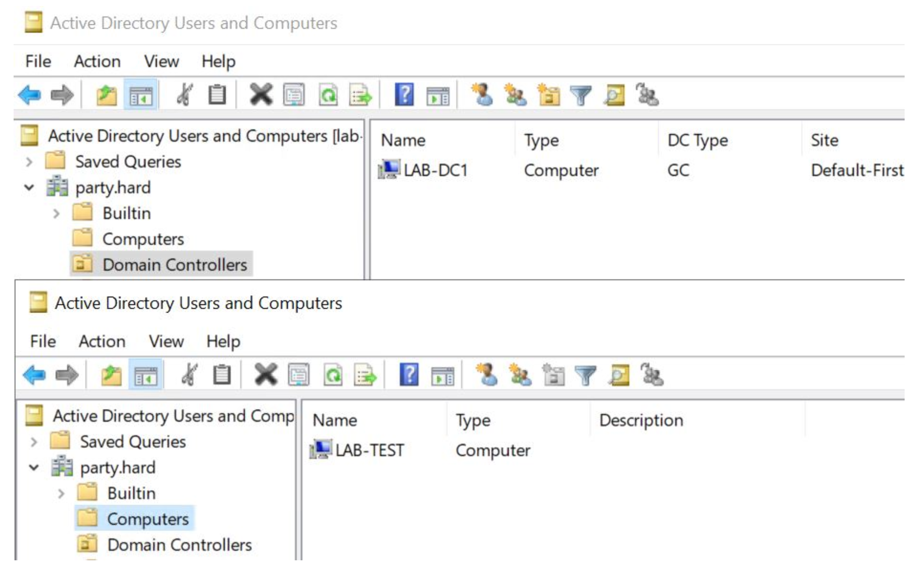
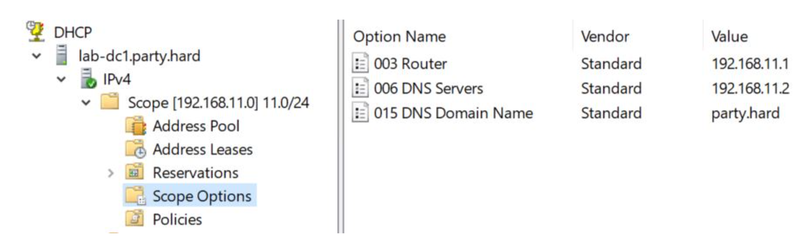
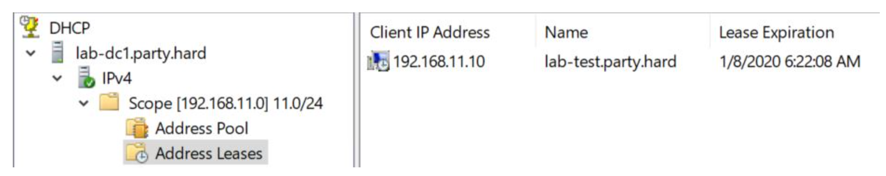

# Active Direcotry Lab mit DHCP | M300, LB2, ST18D

## Inhaltsverzeichnis
- [Active Direcotry Lab mit DHCP | M300, LB2, ST18D](#active-direcotry-lab-mit-dhcp--m300-lb2-st18d)
  - [Inhaltsverzeichnis](#inhaltsverzeichnis)
  - [1. Einführung](#1-einführung)
    - [1.1 Netzwerkplan](#11-netzwerkplan)
  - [2. Installation](#2-installation)
    - [2.1 Voraussetzungen](#21-voraussetzungen)
    - [2.2 Respository Klonen](#22-respository-klonen)
    - [2.3 Domänen Controller erstellen](#23-domänen-controller-erstellen)
    - [2.4 Windows Testserver erstellen](#24-windows-testserver-erstellen)
  - [3. DHCP Service](#3-dhcp-service)
  - [4. Funktionalität](#4-funktionalität)
  - [5. Sicherheitsaspekte](#5-sicherheitsaspekte)
  - [6. PowerShell Scripts](#6-powershell-scripts)
  - [7. Testing](#7-testing)
  - [8. Quellenangabe](#8-quellenangabe)

## 1. Einführung

Dieses Projekt wurde für die LB2 M300 entwickelt, mit dem Ziel eine Active Directory Testumgebung umzusetzen auf Basis von "Infrastructure as Code". 
Die Testumgebung setzt einen Domänencontroller mit DHCP Funktion auf und einen Testserver, welcher vom DHCP vom DC eine IP zugewiesen wird und dieser dann autmatisch der Domäne joint. 
Wir verwenden hierfür die Tools Vagrant und Virtualbox. 

### 1.1 Netzwerkplan
<p>
  
</p>

## 2. Installation


### 2.1 Voraussetzungen

- Windows 7+ / Windows server 2003+
- Powershell v2+
- .NET Framework 4+

Für die Automatische Installation, öffnen Sie `cmd.exe` als Administrator und fügen Sie den folgenden Befehl ein.
```bash
@"%SystemRoot%\System32\WindowsPowerShell\v1.0\powershell.exe" -NoProfile -InputFormat None -ExecutionPolicy Bypass -Command "iex ((New-Object System.Net.WebClient).DownloadString('https://chocolatey.org/install.ps1'))" && SET "PATH=%PATH%;%ALLUSERSPROFILE%\chocolatey\bin" && choco install -y vagrant & choco install -y virtualbox
```

### 2.2 Respository Klonen
```bash
git clone https://github.com/FailForImprove/m300_lb
```

Dieses `Vagrantfile` benutzt das [`vagrant-reload`](https://github.com/aidanns/vagrant-reload) Plugin zum Neustart der Windows-VMs während der Bereitstellung. Wenn Sie dieses Plugin noch nicht installiert haben, können Sie es mit folgendem Command installieren:

```bash
vagrant plugin install vagrant-reload
```

Um die Boxen zu bauen, verwenden Sie `vagrant up`.
Jede Box wird zweimal neu gestartet, bis alle Funktionen ausgeführt werden..


### 2.3 Domänen Controller erstellen
Zuerst erstellen wir den Domänen Controller mit DHCP Service.

```bash
vagrant up lab-dc1
```

Danach läuft die Domäne `party.hard` und läuft unter der IP Adresse `192.168.11.2`.


### 2.4 Windows Testserver erstellen

```bash
vagrant up lab-test
```

--- 

Client sollte der Domäne `party.hard` beigetreten sein und vom DHCP die IP Adresse `192.168.11.10` erhalten.

## 3. DHCP Service
Der DHCP Serice auf dem Domänencontroller läuft über die UDP-Ports 67 und 68. Er gibt dem Testserver die DNS noch mit, damit dieser dann auch der Domäne kann beitreten.

Konfiguration:
- DHCP Range: `192.168.11.10-254`
- DNS: `192.168.11.2`
- Gateway: `192.168.11.2`
- Lease Time: 8 Stunden

## 4. Funktionalität
Welche Funktionalität erwarten wir von unserer Testumgebung?
Wir haben wei Hosts im lokalen Netzwerk 192.168.11.0/24. Einer ist der Domänencontroller PARTY.HARD, der andere ist Mitglied dieser Domäne.

LAB-DC1 — 192.168.11.2
- Active Directory Domain Services
- PARTY.HARD Domänenkonfiguration.
- DHCP

LAB-TEST — 192.168.11.10 (IP zugewiesen von DHCP)
- PARTY.HARD Domänenmitglied

## 5. Sicherheitsaspekte

Hostonly Netzwerk für ein geschlossenes Testsystem. Dies ist besonders wichtig, da wir ein DHCP Service auf dem Domänen Controller im Einsatz haben.

---

## 6. PowerShell Scripts

All Scripts are located in Folder [`m300_lb/lb2/scripts`](https://gitlab.com/KakaoSchluerfer/m300_lb/-/blob/master/lb2/scripts/)

|Funktion|Beschreibung|Anwendung|
|:--|:--|--:|
|[`ConfigureRebootOnNode.ps1`](https://github.com/FailForImprove/m300_lb/blob/main/LAB/provision/ConfigureRebootOnNode.ps1)|Konfiguriert bei Bedarf den Neustart des Hosts|``lab-test``|
|[`DSCInstallDHCP.ps1`](https://github.com/FailForImprove/m300_lb/blob/main/LAB/provision/DSCInstallDHCP.ps1)|Installieren Sie die DHCP-Rolle, RSAT-DHCP-Komponente, autorisieren Sie den DHCP-Server in AD nach der Installation und konfigurieren Sie den Bereich.|`lab-dc1`|
|[`DSCInstallDomain.ps1`](https://github.com/FailForImprove/m300_lb/blob/main/LAB/provision/DSCInstallDomain.ps1)|Installieren Sie die AD DS-Rolle, die RSAT-ADDS-Komponente, und konfigurieren Sie die "PARTY.HARD" Domäne.|`lab-dc1`|
|[`SCJoinDomain.ps1`](https://github.com/FailForImprove/m300_lb/blob/main/LAB/SCJoinDomain.ps1)|Host zur Active Directory-Domäne hinzufügen.|`lab-test`|
|[`PreDSCInstall.ps1`](https://github.com/FailForImprove/m300_lb/blob/main/LAB/provision/PreDSCInstall.ps1)|Installation erforderlich für Arbeit DSC-Module.|`lab-dc1` / `lab-test`|

---

## 7. Testing
Kontrolle ADUC-Snap-In. Eine Domäne ist vorhanden und Mitgliederhosts befinden sich in den entsprechenden Organisationseinheiten:
<p>
  
</p>

Es scheint, dass es auch keine Probleme mit DHCP gab. Wir können sehen, dass der Bereich hinzugefügt wurde.
<p>
  
</p>

In der Liste der geleasten Adressen sehen wir unsere zweite VM.
<p>
  
</p>


## 8. Quellenangabe

- https://vagrantup.com/docs
- https://medium.com/subpointsolutions/building-a-disposable-windows-2016-domain-controller-in-20-minutes-with-vagrant-fce6eb4e01bd
- https://github.com/dsccommunity/ActiveDirectoryDsc
- https://github.com/dsccommunity/xDhcpServer