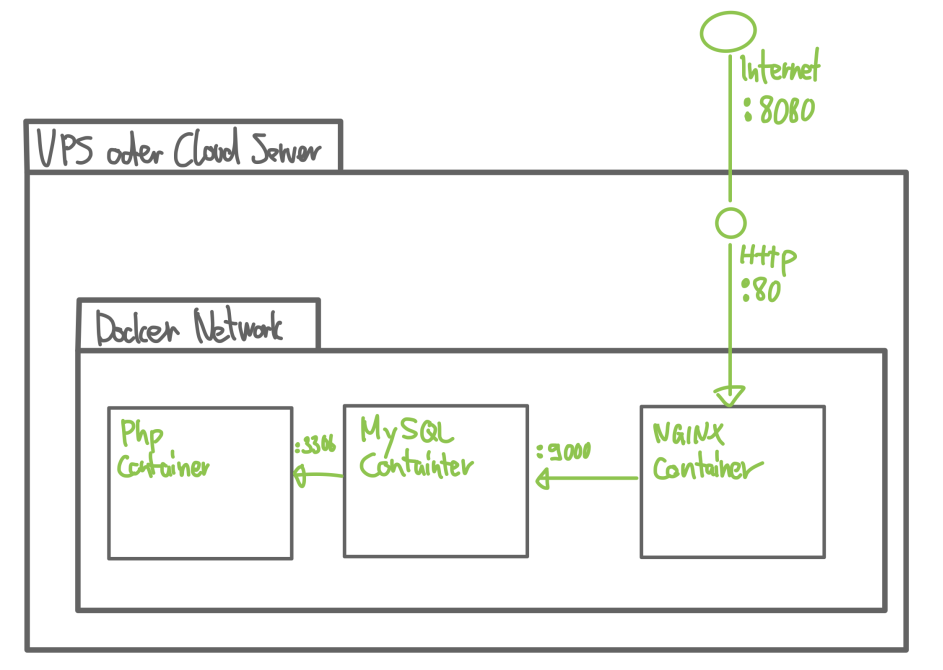
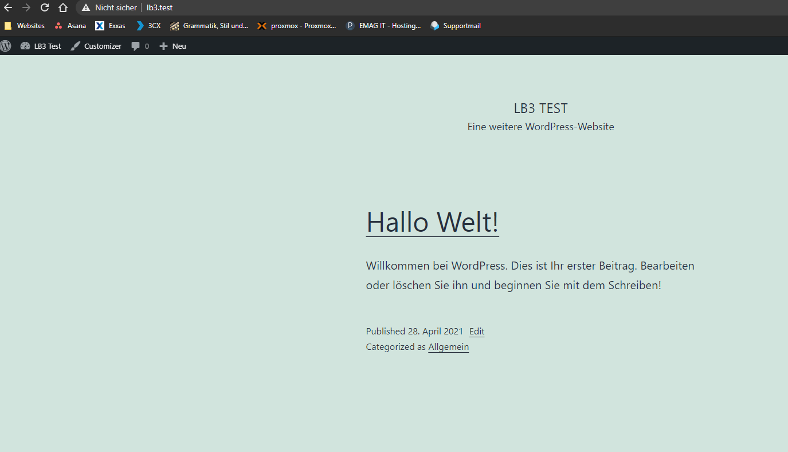
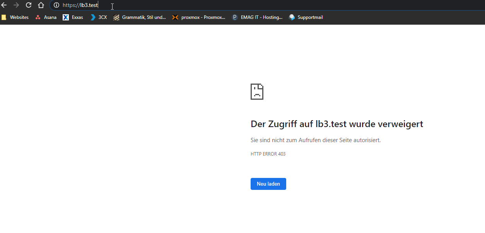

# LB3 - Wordpress mit Reverse Proxy Webentwicklung Umgebung

## Inhaltsverzeichnis
- [LB3 - Wordpress mit Reverse Proxy Webentwicklung Umgebung](#lb3---wordpress-mit-reverse-proxy-webentwicklung-umgebung)
  - [Inhaltsverzeichnis](#inhaltsverzeichnis)
  - [1. Einführung](#1-einführung)
    - [1.1 Netzwerkplan](#11-netzwerkplan)
  - [2. Installation](#2-installation)
    - [2.1 Voraussetzungen](#21-voraussetzungen)
      - [2.1.1 Hostdatei ändern](#211-hostdatei-ändern)
    - [2.2 Respository Klonen](#22-respository-klonen)
    - [2.3 Container starten](#23-container-starten)
    - [3.0 Funktionalität](#30-funktionalität)
    - [4.0 Testing](#40-testing)
  - [8. Quellenangabe](#8-quellenangabe)

## 1. Einführung
Dieses Projekt wurde für die LB3 M300 entwickelt, mit dem Ziel ein produktives Wordpress Webentwicklung Umgebung mit Reverse Proxy umzusetzen auf Basis von "Infrastructure as Code". 
Die produktive Webentwicklung Umgebung besitzt eine MySQL Datenbank und ein Wordpress Container.

Wir verwenden hierfür die Tools Docker. 

### 1.1 Netzwerkplan
Diese Illustration zeigt eine Multi-Container Deployment für Wordpress mit Docker:
<p>
  
</p>

## 2. Installation

### 2.1 Voraussetzungen

- Windows 7+ / Windows server 2003+
- Powershell v2+
- .NET Framework 4+

#### 2.1.1 Hostdatei ändern
- Hostfile ändern
- Suchen Sie im Startmenü den Eintrag „Editor“ und rechtsklicken Sie darauf. Wählen Sie „Als Administrator ausführen“.
- Gehen Sie im Editor unter „Datei“ auf den Menüpunkt „Öffnen“.
- Öffnen Sie die „hosts“-Datei im Windows Explorer über den Pfad C:\Windows\ System32\drivers\etc\hosts.
- Sie können die hosts-Datei nun ändern.
- fügen Sie `127.0.0.1 lb3.test` hinzu

### 2.2 Respository Klonen
```bash
git clone https://github.com/FailForImprove/m300_lb/lb3
```

### 2.3 Container starten

- beim Respository in den Folder `lb3`

- Um die Boxen zu bauen, verwenden Sie `docker compose -d --build`.

### 3.0 Funktionalität

Welche Funktionalität erwarten wir von unserer Testumgebung? Wir haben jeweils 3 parralel laufende Containr.
Dabei übernimmt die nginx Maschine das Hosting des WordPress, MySQL Maschine läuft das WordPress und PHP Maschine ist die Datenbank.
Dabei findet sich bei unserem Respository das File Wordpress und kann somit beliebig angepasst werden.

**FRONTEND:**
Rufen Sie die Webseite mit `localhost` oder `lb3.test` auf, um die Webseite anzusehen.

**BACKEND:**
Rufen Sie das Backend auf, um Plugins/Themes hinzufügen oder ihre Seite bearbeiten. :
http://lb3.test/wp-login.php

**LOGINDATEN:**
- Username: lb3_admin
- Passwort: Start?19


### 4.0 Testing

**Testcase 1**
SOLL Ergebnis:
- Beim aufrufen von der URL `lb3.test` sollte eine WP Default-Webseite erscheinen
IST Ergebnis:
- WP Default-Webseite erscheint 
<p>
  
</p>
Status:
- Erfolgreich

**Testcase 2**
SOLL Ergebnis:
- Beim ändern der WP Webseite oder ergänzen von Plugins wird alles abgespeichert und geht nicht verloren 
IST Ergebnis:
- Nach `docker compose down` und `docker compose -up` findet kein Datenverlust statt
Status:
- Erfolgreich

**Testcase 3**
SOLL Ergebnis:
- Beim aufrufen von der URL `https://lb3.test` sollte eine WP Default-Webseite erscheinen
IST Ergebnis:
- Error 443
<p>
  
</p>
Status:
- Erfolgreich

## 5. Quellenangabe

- https://hub.docker.com/_/wordpress
- https://docs.docker.com/engine/
- https://www.ionos.de/digitalguide/server/knowhow/wordpress-in-docker-containern/
